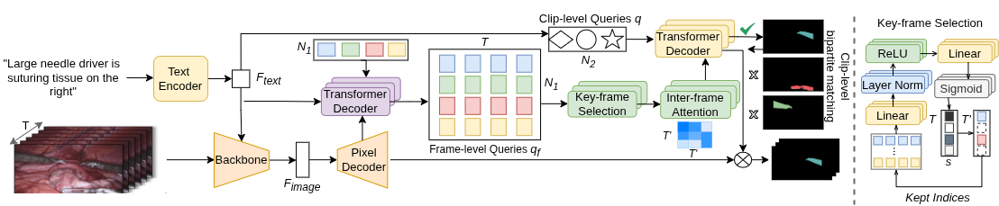

# SurgRef: Referring Surgical Instrument Segmentation via Motion



## Overview

SurgRef is a motion-guided referring video segmentation framework that grounds natural language expressions in surgical videos by explicitly modeling instrument motion. Unlike methods relying on static appearance cues, SurgRef interprets motion-centric expressions (e.g., "the tool entering from the right and retracting the gallbladder medially") to produce fine-grained, temporally localized segmentations.

SurgRef features a key-frame attention selection strategy that adaptively selects expression-relevant frames for improved temporal efficiency and precision. Built on MeViS, VITA and Mask2Former, it achieves state-of-the-art performance with strong generalization across diverse surgical procedures and toolsets.

## Features

- **Motion-Aware Segmentation**: Utilizes temporal motion information for precise surgical instrument tracking and segmentation.
- **key-frame selection**: Improve temporal reasoning and reduce computational cost.
- **Vision-Language Integration**: Supports referring video segmentation using motion centric language expressions.
- **Multi-Dataset Support**: Compatible with datasets like EndoVis 2017/2018, CholecSeg8k, and GraSP.

## Installation

For detailed installation instructions, please refer to [INSTALL.md](INSTALL.md). Or using the **[Dockerfile](nnunet_3dct/Dockerfile)**.

### Quick Setup

1. Clone the repository:
   ```bash
   git clone https://github.com/weimengmeng1999/SurgRef.git
   cd SurgRef
   ```

2. Install dependencies:
   ```bash
   pip install -r requirements.txt
   ```

3. Install Detectron2 following the [official instructions](https://detectron2.readthedocs.io/tutorials/install.html).

4. Compile CUDA kernels:
   ```bash
   cd mask2former/modeling/pixel_decoder/ops
   sh make.sh
   ```

## Data Preparation

### EndoVis Dataset

1. Download the EndoVis 2017 and 2018 datasets from the [MICCAI EndoVis Challenge](https://endovis.grand-challenge.org/).
2. Prepare the data in the expected format (refer to the dataset mappers in `SurgRef/data/`).

### CholecSeg8k Dataset

1. Download the CholecSeg8k dataset.
2. Follow the data preparation scripts in the `tools/` directory.

### GraSP Dataset

To be released after the extension version.

## Training

### Single GPU Training 
#### For EndoVis-IM17

```bash
python train_net_SurgRef.py \
    --config-file configs/SurgRef_SWIN_bs1_EIM17 \
    --num-gpus 1 \
    OUTPUT_DIR outputs/training_run
```
#### For EndoVis-IM18

```bash
python train_net_SurgRef.py \
    --config-file configs/SurgRef_SWIN_bs1_EIM18 \
    --num-gpus 1 \
    OUTPUT_DIR outputs/training_run
```

### Multi-GPU Training
#### For EndoVis-IM17

```bash
python train_net_SurgRef.py \
    --config-file configs/SurgRef_SWIN_bs8_EIM17.yaml \
    --num-gpus 8 \
    --dist-url auto \
    OUTPUT_DIR outputs/training_run
```
#### For EndoVis-IM18

```bash
python train_net_SurgRef.py \
    --config-file configs/SurgRef_SWIN_bs8_EIM18.yaml \
    --num-gpus 8 \
    --dist-url auto \
    OUTPUT_DIR outputs/training_run
```

### Resume Training

```bash
python train_net_SurgRef.py \
    --config-file configs/SurgRef_SWIN_bs8_EIM17.yaml \
    --num-gpus 8 \
    --resume \
    MODEL.WEIGHTS outputs/training_run/model_final.pth \
    OUTPUT_DIR outputs/training_run
```

## Evaluation

### Evaluate on EndoVis

```bash
python train_net_SurgRef.py \
    --config-file configs/SurgRef_SWIN_bs8.yaml \
    --num-gpus 1 \
    --eval-only \
    MODEL.WEIGHTS path/to/model_weights.pth \
    OUTPUT_DIR outputs/evaluation
```

### Evaluate on CholecSeg8k

Use the provided SLURM script:

```bash
sbatch run_mevis_cholecsegk.sh
```

### Custom Evaluation

```bash
python tools/eval_mevis.py \
    --pred_path path/to/predictions \
    --gt_path path/to/ground_truth
```

## Model Configurations

Available configurations in `configs/`:

- `SurgRef_SWIN_bs8.yaml`: Swin Transformer backbone, batch size 8
- `SurgRef_SWIN_bs2.yaml`: Swin Transformer backbone, batch size 2
- `SurgRef_SWIN_bs1_EIM18.yaml`: Swin Transformer backbone, batch size 1, for EndoVis 2018

## Pre-trained Models

Pre-trained models will be available for download. Check the releases page for the latest checkpoints.

## Usage

### Inference on Single Video

```python
from SurgRef import SurgRefModel

model = SurgRefModel(config_file='configs/SurgRef_SWIN_bs8.yaml')
model.load_weights('path/to/weights.pth')
results = model.infer(video_path='path/to/video.mp4')
```

### Batch Processing

Use the evaluation scripts in `tools/` for batch processing of multiple videos.

## Acknowledgement

This project is based on [MeViS](https://github.com/henghuiding/MeViS/tree/main), [VITA](https://github.com/sukjunhwang/VITA), [GRES](https://github.com/henghuiding/ReLA), [Mask2Former](https://github.com/facebookresearch/Mask2Former), and [VLT](https://github.com/henghuiding/Vision-Language-Transformer). We are grateful to the authors for their open-source code and comprehensive explanations.


## Citation

If you use SurgRef in your research, please cite:

```latex
@inproceedings{SurgRef,
  title={Where It Moves, It Matters: Referring Surgical Instrument Segmentation via Motion},
  author={Wei, Meng and Yuan, Kun and Li, Shi and Zhou, Yue and Bai, Long and Navab, Nassir and Ren, Hongliang and Lee, Hong Joo and Vercauteren, Tom and Padoy, Nicolas},
  booktitle={AAAI},
  year={2026}
}
```

